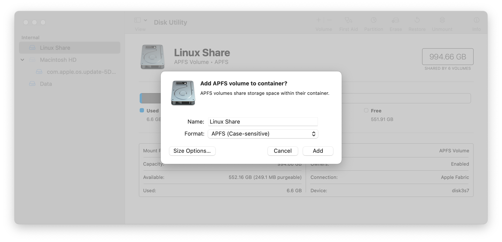

# udm-kernel-docker

Dockerfile and scripts to build [udm-kernel](https://github.com/fabianishere/udm-kernel) on Mac computers with Applie silicon.

## Prerequisites

* [Docker for Apple silicon]<https://www.docker.com>
* macOS 11.6

## Setup

macOS filesystem is case-insensitive by default. The linux sources have certains file names that are the same name but differ in case. Eg: The `net/netfilter` folder has two different files `xt_hl.c` and `xt_HL.c`. These are different files with different purposes, but on a case-insensitive filesystem would be overwritten during git checkout in an unpredictable manner. This may cause build or runtime issues.

To build properly, create a new volume using `Disk Utility` configured to use `APFS (Case-sensitive)`.



Checkout the latest source (including the submodule) to a directory of your choice under the newly created volume.

``` zsh
cd /Volumes/Linux\ Share
git clone --recurse-submodules https://github.com/patelhiren/udm-kernel-docker.git
```

## Building the kernel

Build using the below script.

``` zsh
cd /Volumes/Linux\ Share/udm-kernel-docker/
./build-and-run.sh
```

Once completed the new kernel debs will be available under /src
